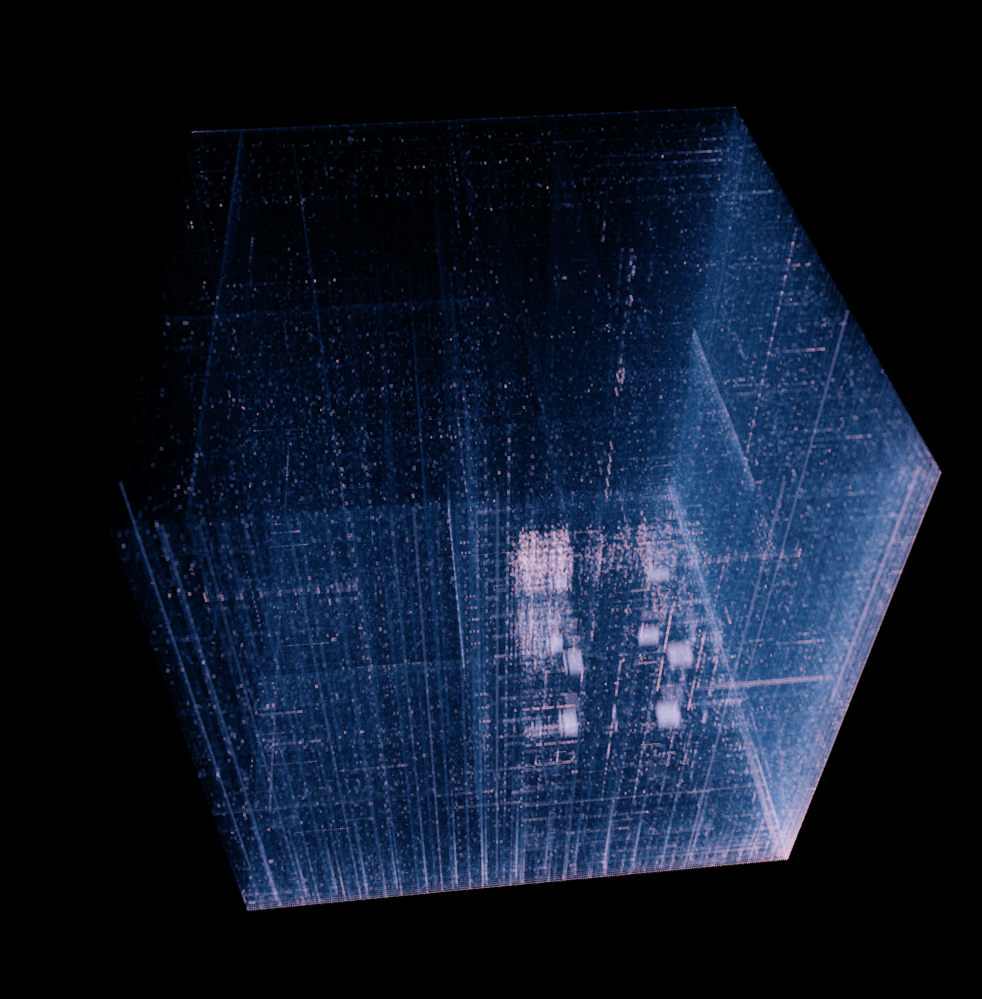
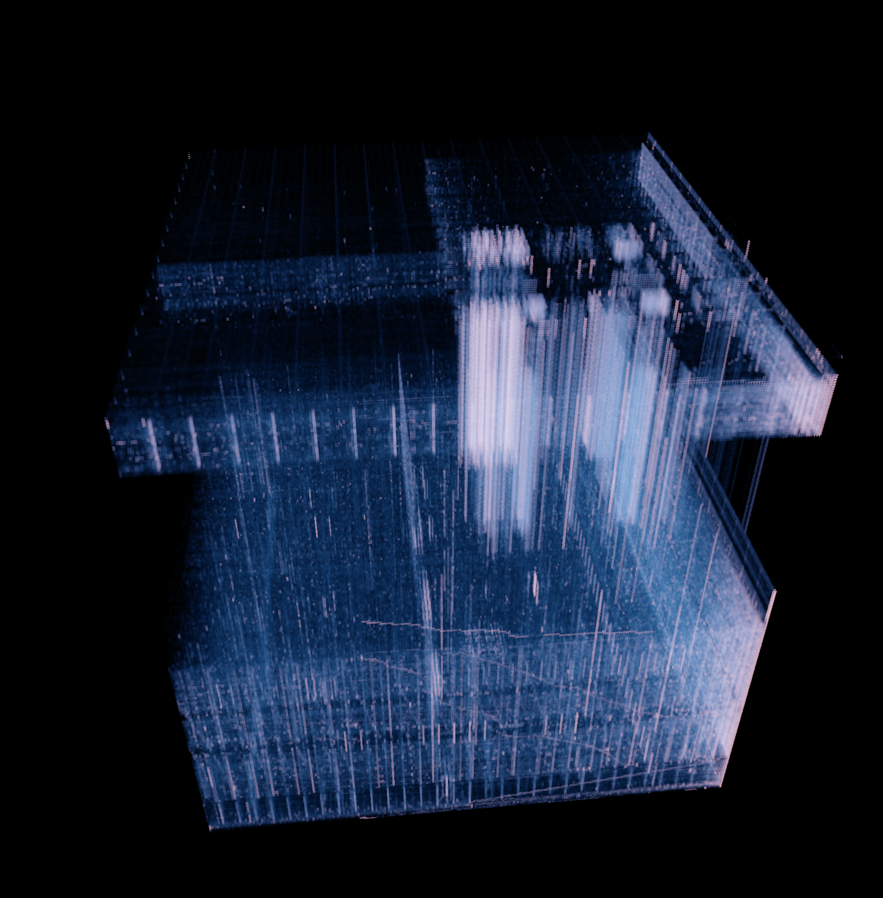

# Hilbertdust

An implementation of the 3d byte histogram display from Chrsitopher Domas's ["The Future of RE Dynamic Binary Visualization"](https://youtu.be/4bM3Gut1hIk?t=917) talk.

Note that there is an open-source version of some of the stuff demonstrated in that talk at [Battelle/cantordust](https://github.com/Battelle/cantordust), but it does not have the 3d display.

